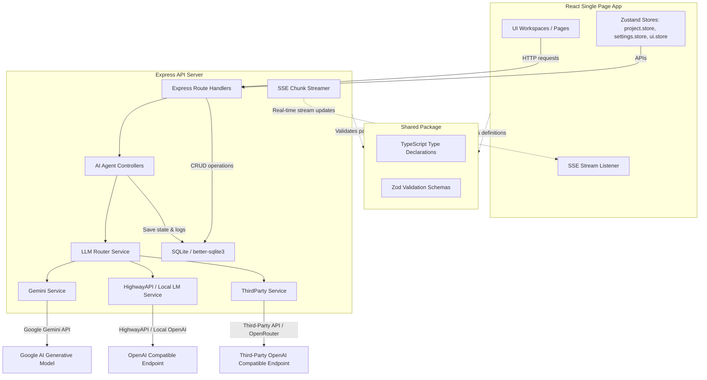

# 🎬 Viral Video Studio AI (VVS Studio)

[](https://www.typescriptlang.org/)
[](https://react.dev/)
[](https://expressjs.com/)
[](https://tailwindcss.com/)
[](https://www.sqlite.org/)
[](https://deepmind.google/technologies/gemini/)

**Viral Video Studio AI (VVS Studio)** is a comprehensive, production-grade video ideation, worldbuilding, scriptwriting, and visual prompt engineering studio. It leverages a sequential, multi-agent AI pipeline to transform a user-provided topic or video transcript into detailed storyboard-ready scenes and optimized prompt files ready for video generation models (like Google Veo).

---

## 🚀 Key Features

### 1. Unified Multi-Agent Pipeline
VVS Studio coordinates multiple specialized AI agents to construct your production:
- **Story Planner Agent**: Generates outline, initial characters, locations, and objects.
- **Production Bible Agent**: Hardens world-building rules (appearance locks, color palettes, and style tokens).
- **Script Agent**: Writes a coherent 10-phase script matching your narrative pacing and style settings.
- **Hook Scorer Agent**: Evaluates the initial hook and enforces quality gates with an interactive AI-assisted rewrite cycle.
- **Story Analyzer Agent**: Predicts viewer retention curves and emotional arcs phase-by-phase.
- **Scene Decomposer Agent**: Translates script phases into granular storyboard-ready scenes with visual state snapshots.
- **Veo Prompt Agent**: Compiles technical prompt parameter cards (visuals, shots, lens, lighting, camera actions, and audio) formatted specifically for video generation.

### 2. Comprehensive Production Bible & World-Building
- **Appearance Lock Panel**: Lock character parameters (ethnicity, age, gender, hair, eyes, clothing, clothing era) so they remain consistent across all script phases.
- **Object Registry & Repair**: Enforce screen-time registries and activate synchronous repair passes.
- **JSON Schema Editor**: Allows direct modification of raw Bible data against strict Zod validation schemas.

### 3. Metric-Driven Script & Scene Workspace
- **Word Count Health Badges**: Live visual indicators of script health (Phase 1: 60–129 words; Phases 2–10: 120–300 words).
- **Retention Curve Graph**: Interactive rendering of predicted viewer percentage retention across the 10 script phases.
- **Visual State Snapshots**: Collapsible panels showing active characters, lighting state, and time of day at the end of each scene.
- **Continuity Stale Detection**: Automatically flags scenes that require snapshots regenerated due to upstream script or Bible modifications.

### 4. Advanced AI Configuration & Key Pool Management
- **Gemini Key Pool**: Input and manage multiple Google Gemini keys with a real-time health grid (RPM/RPD tracking and active cooldowns).
- **Provider Toggles**: Seamlessly configure and toggle between Google Gemini API, Vertex AI, HighwayAPI, Local LM (LM Studio/Ollama), and custom OpenAI-compatible endpoints (DeepSeek, OpenRouter).
- **Prompt Concurrency Slider**: Bounded generation concurrency based on active API keys.

---

## 📐 System Architecture

VVS Studio is organized as a TypeScript monorepo using npm workspaces:



---

## 🛠️ Technology Stack

- **Frontend**: React 19, Vite 8, Zustand 5, Tailwind CSS 4, Framer Motion 12, Lucide React, React Router 7, React Hook Form
- **Backend**: Node.js, Express, better-sqlite3 (SQLite with WAL journal mode), Winston logging, tsx (TypeScript execution)
- **Shared**: Zod, TypeScript types, and utility scripts
- **AI Integrations**: `@google/genai` (Vertex/Gemini), `@google/generative-ai` (Gemini API), `openai` (compatible endpoints)

---

## ⚙️ Setup & Configuration

### Prerequisites
- Node.js (v18 or higher)
- npm (v9 or higher)

### 1. Clone the repository
```bash
git clone https://github.com/haxxposimyth-pixel/Veo-FUk.git
cd Veo-FUk
```

### 2. Configure Environment Variables
Create a `.env` file in the root directory:
```env
GEMINI_API_KEY=your_gemini_api_key_here
PORT=3001
NODE_ENV=development
DB_PATH=./data/viral-video-studio.db
LOG_LEVEL=info
```

*Note: `DB_PATH` specifies where the SQLite file will be created. The system will automatically create directory paths and run database migrations on boot.*

### 3. Install Dependencies & Build
Install all dependencies for frontend, backend, and shared libraries from the root folder:
```bash
npm install
npm run build
```

---

## 🚦 Running the Application

VVS Studio includes scripts to run both the frontend developer server and backend API server simultaneously.

### Development Mode
Runs the backend on port `3001` (with hot reloading via `tsx watch`) and frontend on port `5173` (via Vite):
```bash
npm run dev
```

### Production Mode
Builds all packages and starts the Express production server:
```bash
npm run build
npm start -w backend
```

---

## 🐳 Vertex AI (Google Cloud Platform) Setup

To use Google Cloud Vertex AI instead of Google AI Studio:
1. Create a GCP Service Account in your console with the role `roles/aiplatform.user`.
2. Download the service account JSON key file.
3. Configure the path to the credentials file before running the application:
   ```bash
   # Windows (PowerShell)
   $env:GOOGLE_APPLICATION_CREDENTIALS="C:\path\to\service-account-key.json"

   # Linux/macOS
   export GOOGLE_APPLICATION_CREDENTIALS="/path/to/service-account-key.json"
   ```
4. Set the GCP Project ID (`gcp_project_id`) and Location (`gcp_location`, e.g., `us-central1`) in the application's UI Settings workspace.

---

## 🛠️ Monorepo Build, Grounding, and Testing Details

### 1. Mandatory Build Order
Since the backend and frontend packages consume schemas and types defined in the shared package, you **MUST** build the shared workspace before compiling downstream packages:
1. Compile the shared workspace first:
   ```bash
   npm run build:shared
   ```
2. Build the backend and frontend packages:
   ```bash
   npm run build:backend
   npm run build:frontend
   ```

### 2. Gemini Grounding & Google Search API Key Requirements
The **Production Bible Agent** (`production-bible-agent.ts` line ~163-167) performs a grounded research query when the project topic centers on a specific real-world commercial product. This relies on `GeminiService.generateGroundedText` (defined at `gemini.service.ts` line ~857-910) using the `googleSearch` tool.
* **Requirements**: A valid Gemini API Key with Google Search Grounding capabilities enabled.
* **Troubleshooting**: If the configured key is leaked, invalid, or has search features disabled, the grounding step fails gracefully and logs a warning. The bible generator falls back automatically to the LLM's parametric knowledge. Well-known brands (such as *Sting Energy Drink*, *Coca-Cola*) will still resolve accurately, though less common or obscure products may lose precision.

### 3. Test Runners
To execute validation and benchmark scripts directly on the command line:
* **Branded Product Validation**: Validates the branded product logic (Sting can with branding) vs generic category logic (unbranded Container Ship). Run from the `backend/` workspace:
  ```bash
  npx tsx src/test/query-objects.ts
  ```
* **Resume/Benchmark Runner**: Runs or resumes the agent pipeline benchmarks:
  ```bash
  npx tsx src/test/resume-benchmark.ts
  ```

---

## 📝 License

This project is private and proprietary. All rights reserved.