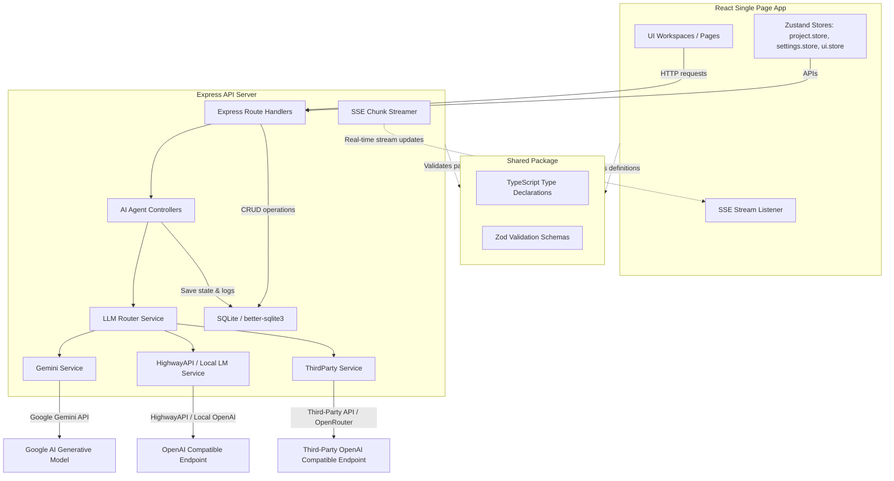

# Project Blueprint: Viral Video Studio AI

This blueprint provides a comprehensive architectural guide of **Viral Video Studio AI (VVS Studio)**. It documents the end-to-end system mechanics, backend processes, data schemas, user inputs, and sequential multi-agent execution pipeline.

---

## 1. System Architecture

VVS Studio is built as a modular TypeScript monorepo utilizing npm workspaces to separate concerns across three packages:
1. **`shared/`**: Common types, models, Zod validation schemas, and API contracts.
2. **`backend/`**: Express API server, SQLite database connection, SSE event streamers, and LLM-powered AI Agents.
3. **`frontend/`**: Single-Page React Web Application styled with Tailwind CSS, using Zustand for global state management and React Router for view orchestration.



---

## 2. Core Database Schema

The persistence layer uses a local SQLite database file (`database.sqlite`) managed via [connection.ts](file:///c:/Users/Admin/Desktop/YT_Prompt.ai/backend/src/db/connection.ts) using the WAL journal mode. The database tables are defined using clean, relational migrations:

| Table | Primary Key | Foreign Keys | Key Attributes / Columns | Purpose |
| :--- | :--- | :--- | :--- | :--- |
| **`projects`** | `id` (UUID) | `style_id` → `custom_styles(id)` | `title`, `topic`, `visual_style`, `narration_language`, `aspect_ratio`, `youtube_transcript`, `status` | Stores metadata and active configuration for each created video project. |
| **`story_plans`** | `id` (UUID) | `project_id` → `projects(id)` (UNIQUE) | `story_outline`, `character_list` (JSON array), `location_list` (JSON array), `object_list` (JSON array), `estimated_runtime`, `estimated_scene_count`, `complexity_score`, `approved` | Pre-Bible narrative planning: story arc, characters, locations, objects, pacing targets. |
| **`production_bibles`** | `id` (UUID) | `project_id` → `projects(id)` | `character_roster` (JSON with mandatory `appearance_lock`), `location_roster` (JSON), `object_registry` (JSON), `visual_style_lock` (JSON), `raw_json`, `version` | Holds the worldbuilding data: characters (with locked visual characteristics), locations, symbolic objects, and style locks. The `version` column auto-increments on every Bible regeneration and is used to track whether downstream Veo prompts are outdated. |
| **`scripts`** | `id` (UUID) | `project_id` → `projects(id)` | `raw_json` (ScriptData), `approved`, `version` | Contains the 10-phase narrative script metadata. |
| **`phases`** | `id` (UUID) | `project_id` → `projects(id)` | `phase_number`, `phase_type`, `phase_title`, `phase_content`, `narration_text`, `narration_word_count`, `approved`, `scenes_generated`, `status`, **`hook_score`** (REAL), **`hook_score_breakdown`** (TEXT/JSON), **`hook_score_passed`** (INTEGER), **`hook_score_borderline`** (INTEGER), **`rehook_required`** (INTEGER), **`rehook_validated`** (INTEGER), **`rehook_type`** (TEXT) | Keeps individual script phases separately. Tracks hook scores for Phase 1, borderline status, and mid-video re-hook validation configurations. Unique constraint on `(project_id, phase_number)`. |
| **`scenes`** | `id` (UUID) | `project_id` → `projects(id)`, `phase_id` → `phases(id)` | `phase_number`, `scene_number`, `title`, `scene_description`, `continuity_notes`, `narration_fragment`, `veo_prompt_generated`, `status`, `raw_json`, `narration_word_count`, **`visual_state_snapshot`** (TEXT/JSON), **`continuity_stale`** (INTEGER DEFAULT 0) | Breakdown of script phases into granular storyboard-ready scenes. Tracks character visual state snapshot at the end of each scene. The `continuity_stale` flag (0/1) marks scenes whose snapshot chain has been invalidated by an upstream edit or regeneration; Veo prompt generation is blocked until stale scenes are repaired. Supports status: `'needs_review'` on character mismatch warnings. Unique constraint on `(project_id, phase_number, scene_number)`. |
| **`veo_prompts`** | `id` (UUID) | `project_id` → `projects(id)`, `scene_id` → `scenes(id)` | `phase_number`, `scene_number`, `prompt_number`, `visual`, `shot`, `lens`, `lighting`, `camera`, `ambient_sound`, `sfx`, `dialogue`, `avoid`, `connection`, `narration`, `duration_seconds`, `veo_full_prompt`, `raw_json`, `version`, `manually_edited`, `visual_truncated`, **`shot_type`** (TEXT), **`appearance_violation`** (INTEGER), **`appearance_corrected`** (INTEGER), **`lighting_kelvin`** (INTEGER), **`scene_type`** (TEXT), **`avoid_contradiction`** (INTEGER) | Compiled technical output prompt parameters optimized for Veo. Tracks appearance violations, validator corrections, and avoid field conflicts. `bible_version` is stored inside `raw_json` to track which Production Bible version generated the prompt; the GET `/prompts` endpoint computes a `bible_outdated` flag at read time. Unique constraint on `(project_id, phase_number, scene_number, prompt_number)`. |
| **`story_analyses`** | `id` (UUID) | `project_id` → `projects(id)` (UNIQUE) | `summary` (TEXT), `raw_json` (TEXT) | Holds the phase-by-phase predictive viewer retention scores, hook densities, and emotional intensity scores. |
| **`video_metadata`** | `id` (UUID) | `project_id` → `projects(id)` (UNIQUE) | `selected_title` (TEXT), `description` (TEXT), `chapters` (TEXT/JSON), `tags` (TEXT/JSON), `hashtags` (TEXT/JSON), `thumbnail_hook` (TEXT), `raw_json` (TEXT) | Stores SEO-optimized YouTube titles, tags, and chapter marks generated for the project. |
| **`agent_logs`** | `id` (UUID) | `project_id` → `projects(id)` (ON DELETE SET NULL) | `agent_name`, `model_used`, `input_tokens`, `output_tokens`, `duration_ms`, `status` ("success"||"failed"), `error_message`, `input_prompt`, `output_response`, **`repair_attempts`** (INTEGER) | Stores agent run telemetry, raw prompts, model responses, and number of repair attempts for debugging. |
| **`settings`** | `key` (TEXT) | None | `value` | Manages global API configurations (Gemini credentials, HighwayAPI credentials, Local LM configurations, Third-Party OpenAI-compatible provider credentials, active model, and constraints). |
| **`custom_styles`** | `id` (UUID) | None | `name`, `description` | Styles are selected at Project Setup and merged into the Production Bible. Locked read-only per project after Bible generation. |
| **`continuity_warnings`** | `id` (UUID) | `project_id` → `projects(id)`, `phase_id` → `phases(id)` | `prompt_number`, `field`, `issue`, `suggestion`, `resolved`, `cross_phase` | Warnings for scene continuity issues. `cross_phase = 1` indicates cross-phase drift detected by full-project scan. |

---

## 3. User Inputs & Frontend Workflow

### Step 1: Project Initialization & Configuration
Users provide the foundational inputs in [ProjectSetup.tsx](file:///c:/Users/Admin/Desktop/YT_Prompt.ai/frontend/src/pages/ProjectSetup.tsx):
- **Core Topic / Theme**: Description of the video theme, facts, and key ideas.
- **YouTube Transcript (Optional)**: Pasted transcript. If supplied, the agents use it as a primary reference source to extract character rosters, set locations, and preserve vocabulary.
- **Visual Style Preset / Custom**: E.g., Cinematic Realism, Sci-Fi Noir, or custom styles dynamically fetched from the database.
- **Narration Language**: Target voiceover language (e.g. English, French, Japanese).
- **Aspect Ratio**: Target screen size (16:9 Landscape, 9:16 Vertical, 1:1 Square).

*Auto-Save Mechanics*: Frontend updates are sent to the database in the background using a debounced `useAutoSave` custom React hook.

### Step 1.5: Story Planning Workspace
After initial setup, the user enters [StoryPlanWorkspace.tsx](file:///c:/Users/Admin/Desktop/YT_Prompt.ai/frontend/src/pages/StoryPlanWorkspace.tsx):
- **Story Planner Agent**: Generates a narrative outline, character list, location list, and object/prop registry from the project topic.
- **Editable Plan**: Users can revise the story outline, add/remove characters, locations, and objects, adjust estimated runtime, scene count, and visual complexity.
- **Pacing & Metrics Panel**: Right sidebar with estimated runtime, scene count estimate, and a visual complexity slider (1–100%).
- **View Full Script Button**: Conditionally rendered only when the project has reached `script` status or later. Opens a read-only modal display.
- **Downstream Edit Warning**: If the user has already generated a script or later assets and attempts to save or approve edits in the Story Plan, a confirmation dialog warns that downstream data will not automatically update.
- **Approve & Proceed**: Saves the plan and advances the project to the Production Bible step.

### Step 1.8: Production Bible Workspace
[ProductionBible.tsx](file:///c:/Users/Admin/Desktop/YT_Prompt.ai/frontend/src/pages/ProductionBible.tsx) is the central workspace for reviewing world-building rules before script generation:
- **4-Section Sticky Nav**: Sidebar navigation to quickly jump between Characters, Locations, Objects, and Visual Style locks.
- **Swatches and Tag Badges**: Renders visual swatches for color palettes and inline tag badges for Veo style tokens.
- **Appearance Lock Panel**: Expandable character visual locking system detailing ethnicity, age, gender, skin tone, hair, eyes, face structure, distinguishing features, primary clothing, clothing colors, clothing era, accessories, and forbidden appearance changes. Renders color swatches for clothing colors and warning badges for forbidden changes.
- **JSON Editor Modal**: Allows direct modification of raw Bible data against the strict Zod schema `productionBibleAgentOutputSchema`.
- **Regenerate Bible**: Re-trigger generation with verification warning alerts.
- **Generate Script**: Commits the Bible locks and runs the script agent.
- **Repair Registry**: Placed in the Object Registry header. Activates a synchronous backend repair pass if the registry has fewer than 20 objects, showing a loading spinner and refreshing the list on completion with a toast message.

### Step 2: Dashboard & Multi-Phase Navigation
- **Smart Resume Navigation**: When users click an existing project card on the dashboard, the system bypasses setup and redirects them directly to the pipeline step corresponding to their current status (e.g., `bible`, `script`, `scenes`, or `complete`).
- **AI Model Quota Visualizer**: Renders a premium card on the Dashboard showing remaining daily quotas (tokens and requests) for the selected AI model. The system queries actual telemetry from the last 24 hours of database logs, presenting it on rounded, glow-styled progress bars (indigo/blue gradient for tokens, emerald/teal gradient for requests).
- **Phase Status & Retry Support**: Phase scene generations are tracked with granular statuses (`pending`, `processing`, `done`, `failed`). If scene generation fails, a **Retry Phase** button is exposed.
- **Multi-Phase Prompt Views**: The Prompt Workspace supports navigating and filtering prompts phase-by-phase with quick phase filters and direct step-back controls.

### Step 3: Script Workspace
[ScriptWorkspace.tsx](file:///c:/Users/Admin/Desktop/YT_Prompt.ai/frontend/src/pages/ScriptWorkspace.tsx) manages the 10-phase script pipeline:
- **Script Tone Sliders**: Tone configuration panel: Pacing (1–10), Emotional Intensity (1–10), and Narration Style (1–10).
- **Word Count Health Badge**: Live recalculation color-coded badge:
  - **For Phase 1**:
    - 🔴 Red: `< 60` words — "Too short"
    - 🟢 Green: `60–129` words — healthy range
    - 🟡 Amber: `130–140` words — "Near limit"
    - 🔴 Red: `> 140` words — "Over limit"
  - **For Phases 2–10**:
    - 🔴 Red: `< 120` words — "Too short"
    - 🟢 Green: `120–300` words — healthy range
    - 🟡 Amber: `301–360` words — "Near limit"
    - 🔴 Red: `> 360` words — "Over limit"
- **Phase Card Footer Duration Display**: Formats and renders duration based on Veo prompt status:
  - If Veo prompts exist for the phase: `"Duration: {total}s"` (sum of all `veo_prompts.duration_seconds` matching the phase number).
  - If no Veo prompts exist yet for the phase: `"Duration: ~{estimated}s (est.)"` (estimated as `Math.round(phase.narration_word_count / 1.8)`).
- **Hook Quality Score Panel**: Visible on Phase 1. Scores the hook and highlights a **Fix with AI ↗** suggestions rewrite loop next to a **Re-score** button. Shows status badges: `Passed ✓` (overall score $\ge 7.0$), `Borderline ⚠` ($6.5 \le \text{overall} \le 6.9$, with a warning tooltip), or `Failed ✗` ($< 6.5$). Tracks rewrite attempts inline (e.g., `(attempt 2)`).
- **Retention Curve Graph**: Displayed under the script phases using data from the Story Analyzer Agent, mapping predicted viewer percentages per phase.
- **Pluralization-Aware Bottom Warning Banner**: Renders a sticky warning banner detailing flagged phases with narration under the minimum word counts. Uses conditional logic to render:
    - For 1 flagged phase: `"1 phase has narration under the minimum word count and will produce too few scenes. Regenerate or edit the flagged phase before approving."`
    - For other counts: `"{flaggedCount} phases have narration under the minimum word count and will produce too few scenes. Regenerate or edit the flagged phases before approving."`
- **Approval Gate**: Disabled if any phase fails narration word limits (Phase 1 $< 60$ words, other phases $< 120$ words) or if the Phase 1 Hook Quality Score is $< 6.5$ (neither Passed nor Borderline). Displays a warning prompt if the score is borderline, suggesting the user strengthen it but allowing them to approve.

### Step 4: Scene Workspace
[SceneWorkspace.tsx](file:///c:/Users/Admin/Desktop/YT_Prompt.ai/frontend/src/pages/SceneWorkspace.tsx) manages visual storyboard decomposition per phase. It triggers generation sequentially for each phase. Sequential generation prevents database locks and ensures correct sequential context propagation. "Regenerate All" now safely merges (inserts or ignores) new scenes, strictly avoiding destructive delete cascades.
- **Visual State Snapshot Collapsible**: Inside each scene card, renders an expandable panel displaying characters present, location state, time of day, atmosphere, and key visible objects at the end of the scene. Supports backward compatibility with old keys.
- **Needs Review Alerts**: Scenes with status `"needs_review"` render a red border outline, display the associated continuity warnings, and show a `"Regenerate Scene"` shortcut button.
- **Continuity Stale Indicators**: Scenes flagged as `continuity_stale = 1` (due to upstream edits/regenerations) render a visual staleness badge. A **Repair Continuity** action button triggers the sequential re-extraction of visual snapshots for all stale scenes.
- **Predecessor Phase Gating**: Generate and Retry buttons for Phase $N$ are disabled with explanatory tooltips if any predecessor phase $p < N$ is not `'done'` or lacks a visual state snapshot on its last scene.
- **Single Phase Scene Regeneration**: Users can trigger a clean regeneration of scenes for an individual phase. The **Regenerate Scenes** button is displayed on the active phase details panel when scenes exist or if the phase has failed. Additionally, a quick-access **Regenerate Scenes** button (with a `RotateCcw` icon) is rendered next to every phase item in the sidebar timeline list (visible whenever a phase is not in a `'processing'` state). Both buttons trigger `scenesApi.generateScenes(id, { phaseNumber, regenerate: true })` after prompting for user confirmation.
- **Generate All Scenes Pipeline**: A bulk sequential execution engine triggered from the workspace toolbar. It processes every phase in order (Phase 1 to N: generating scenes, then generating Veo prompts, and then moving to the next phase) to prevent state conflicts and agent overlaps. A per-project mutex (see §4) prevents concurrent generation. Renders a premium status card with a progress bar, current step label, a cancellation controller, and a retry button to resume execution from a failed phase.
- **Lock Conflict Handling**: If generation is attempted while another task holds the project lock, the 409 response is caught and displayed as a user-friendly toast message.
- **SSE Stream Inactivity Watchdog**: Implements a client-side watchdog timer inside `runAgentStep` that monitors active SSE stream connections. If no chunks/events are received for 90 seconds, the watchdog automatically cleans up, aborts the request connection, and throws a timeout error to prevent the UI from hanging.

### Step 5: Veo Prompt Workspace
[VeoPromptWorkspace.tsx](file:///c:/Users/Admin/Desktop/YT_Prompt.ai/frontend/src/pages/VeoPromptWorkspace.tsx) manages the final video prompt cards:
- **Scene Group Header**: Renders an uppercase, styled group header reading "Scene {scene_number} · {count} clips" (or just "Scene {scene_number}" if count is 1) above the first prompt card of each scene in the list.
- **Local Prompt Indexing**: Resolves database prompts per scene and overrides `promptRow.prompt_number` with its local 1-based index (1, 2, 3) inside the scene list mapping, keeping sibling prompts visually distinct and chronological.
- **Shot Classification Badges**: Rendered before prompt titles representing the scene's dynamic layout (e.g. `establishing`, `wide`, `close_up`, `extreme_close_up`, `aerial`, etc.).
- **Shot Diversity Visualizers**: Shows a row of colored dots representing the distribution of camera frames/movements across phases.
- **Appearance Correction Badges**: Prompts displaying corrected visual descriptions render an amber `"Appearance auto-corrected"` badge with a descriptive hover tooltip.
- **Bible Outdated Badge**: Displays a yellow `"Bible Outdated"` badge next to the prompt header if the prompt's version is older than the current Production Bible version (indicating regeneration is needed).
- **Inline Editing**: Allows modification of visual, lens, lighting, camera, sound, avoid, and connection parameters. **Manual edits trigger a re-validation pass** (report-only, no auto-correction) via the expanded `VeoAgent_AppearanceValidator` and return active violation annotations.
- **One-Click AI Fix**: Renders a **"Fix with AI"** button next to each warning inside the continuity warnings panel, triggering automatic, targeted prompt corrections.
- **Export Readiness Card**: A top-level status card displays the project's integrity verdict (`"ready"` / `"issues"`) with deep-links to specific issue categories (stale scenes, failed prompts, Bible-outdated prompts, unresolved continuity warnings). Non-blocking warning toasts appear on copy/export actions when the verdict is `"issues"`.
- **Extended Status Filters**: Additional filter options — `outdated`, `failed`, and `warnings` — enable rapid triage of problematic prompts.

### AI Pipeline Settings Workspace
[AISettings.tsx](file:///c:/Users/Admin/Desktop/YT_Prompt.ai/frontend/src/pages/AISettings.tsx) provides a centralized dashboard to manage provider credentials and the active LLM:
- **Active Model Selector**: A single dropdown populated dynamically by calling `/available-models` based on configured credentials. Users select one model globally, and all downstream pipeline agents are automatically routed to it.
- **Provider Credentials Sections**:
  - **Google Gemini Key Pool**: Bulk-paste input allowing for 80+ Gemini API keys. Includes a real-time key health grid visualizing active cooldowns, quotas, and remaining RPM/RPD per model across all keys. Keys and cooldown states are synced to SQLite.
  - **HighwayAPI**: Toggle configuration to enable HighwayAPI, allowing base URL, model name, and API key configurations, along with an inline validate button.
  - **Local LM**: Toggle configuration to enable local OpenAI-compatible endpoints running on `http://localhost:1234/v1` (e.g. LM Studio, Ollama).
  - **Third-Party Providers**: Toggle configuration to enable custom OpenAI-compatible endpoints (e.g. OpenRouter, DeepSeek) supporting custom base URL, model name, API key configurations, and validation testing.
- **Global Constraints Sliders**: Sliders to tune active model Temperature, Max Output Tokens, and Advanced tuning parameters (Top-P, Top-K).
- **Prompt Concurrency Controller**: A range slider (1–10) allowing configuration of bounded concurrency for prompt generation tasks (`generationConcurrency`), which dynamically limits concurrent API workers based on the key pool capacity.

---

## 4. Backend Processing & AI Agent Pipeline

Once setup is complete, the user triggers the sequential execution of **specialized AI agents** matching the pipeline steps:

```
[ User Topic & Transcript ]
           ↓
 ┌───────────────────┐
 │   Story Planner   │  ➔ Agent 0: StoryPlannerAgent
 └─────────┬─────────┘
            ▼
 ┌───────────────────┐
 │ Production Bible  │  ➔ Agent 1: ProductionBibleAgent
 └─────────┬─────────┘
            ▼
 ┌───────────────────┐
 │  10-Phase Script  │  ➔ Agent 2: ScriptAgent
 └─────────┬─────────┘
            ▼
 ┌───────────────────┐
 │ Hook Quality Gate │  ➔ Agent 2.5: HookScorerAgent
 └─────────┬─────────┘
            ▼
 ┌───────────────────┐
 │  Story Analyzer   │  ➔ Agent 2.6: StoryAnalyzerAgent
 └─────────┬─────────┘
            ▼
 ┌───────────────────┐
 │ Visual Storyboard │  ➔ Agent 3: SceneAgent
 └─────────┬─────────┘
            ▼
 ┌───────────────────┐
 │ Veo Video Prompts │  ➔ Agent 4: VeoAgent
 └─────────┬─────────┘
            ▼
 ┌───────────────────┐
 │ Title & Metadata  │  ➔ Agent 6: TitleMetadataAgent
 └─────────┬─────────┘
            ▼
 ┌───────────────────┐
 │ Continuity Scan   │  ➔ Agent 5: ContinuityAgent (Per-phase & Cross-phase)
 └─────────┘
```

### Agent 0: Story Planner Agent
- **File Reference**: [story-planner-agent.ts](file:///c:/Users/Admin/Desktop/YT_Prompt.ai/backend/src/agents/story-planner-agent.ts)
- **Input**: Project topic, style presets, optional transcript.
- **Output**: Story outlines, characters, locations, and objects.

### Agent 1: Production Bible Agent
- **File Reference**: [production-bible-agent.ts](file:///c:/Users/Admin/Desktop/YT_Prompt.ai/backend/src/agents/production-bible-agent.ts)
- **Input**: Story outline/elements, user settings, style lock requirements.
- **Output**: JSON payload of world building locks (character roster, location roster, object registry, visual style lock tokens, meta), including a mandatory `appearance_lock` configuration for each character.
- **Exhaustive Object Registry**: Instructs the model to exhaustively register all visible screen items from 6 categories (character body enhancements/modifications, worn apparel/armor, carried weapons/tools/props, permanent background location props, transient scene props, and narrative story objects) with details: `object_id`, `name`, `category`, `owner_or_location`, `visual_description`, `default_state`, `active_state`, and `forbidden_variations`.
- **Minimum Count & Self-Healing Repair**: Enforces a minimum of 20 registry objects. If generation yields less, it automatically executes a secondary repair pass with a targeted Gemini prompt, deduplicates results, saves the expanded registry, and logs to `agent_logs` under `'ProductionBibleAgent_ObjectRepair'`.

### Agent 2: Script Agent
- **File Reference**: [script-agent.ts](file:///c:/Users/Admin/Desktop/YT_Prompt.ai/backend/src/agents/script-agent.ts)
- **Input**: User topic, Production Bible, and Script Tone parameters.
- **Viral Structure & Re-hook Rules**:
  - Phase 1 must follow Pattern Interrupt → High Stakes → Curiosity Gap layout.
  - Mid-video **Re-hook Beats** are mandatory for **Phases 4, 6, and 8** (re-hook type: `new_question`, `revelation`, `stakes_escalation`, or `pattern_interrupt`).
- **Bible Context Optimization**: Serializes the `character_roster`, `location_roster`, and `visual_style_lock` once into a single context block before starting the phase loop, replacing bible object serialization within the loop prompts.
- **Overlapping Transcript Segmentation**: Rather than passing the full YouTube transcript to all phases, splits the transcript into 10 overlapping segments based on word count. Injects only the corresponding segment `transcriptSegments[i - 1]` to reduce token overhead.
- **Merged Schema Content Extraction**: Removes the separate `ScriptAgent_ContentExtractor` LLM call from the loop by merging target extraction fields (`key_facts`, `key_images`, `key_events`, and `characters_mentioned`) directly into the main Zod schema (`optimizedScriptPhaseItemSchema`) for single-pass extraction.
- **Coupled Narration & Visuals**: When a phase's narration names a list or montage of distinct concrete subjects (e.g. "coffee, phone, shoes"), the script agent MUST couple them by writing a visual blueprint (`phase_content`) that contains an explicit visual beat for each named subject.
- **Rewrite with Suggestions**:
  - Implements `rewriteHookWithSuggestions` using suggestions, production bible constraints, script tone parameters, and Phase 2 continuity to compile an automatically improved Phase 1 hook script.

### Agent 2.5: Hook Scorer Agent
- **File Reference**: [hook-scorer-agent.ts](file:///c:/Users/Admin/Desktop/YT_Prompt.ai/backend/src/agents/hook-scorer-agent.ts)
- **Input**: Phase 1 narration text.
- **Score Metrics**: Assigns scores (1-10) for pattern interrupt, stakes clarity, curiosity gap, and scroll stop power. Includes a `hard_stop_violated` check (if the hook continues past the curiosity gap question, the overall score is capped at 5.0).
- **Median-of-3 Scoring Pass**: Executes the scoring prompt 3 times in parallel, calculates the median for overall and sub-scores, resolves `hard_stop_violated` by majority vote, merges and deduplicates suggestions, and computes the `score_variance`. If variance $> 1.5$, it appends a low-confidence warning.

### Agent 2.6: Story Analyzer Agent
- **File Reference**: [story-analyzer-agent.ts](file:///c:/Users/Admin/Desktop/YT_Prompt.ai/backend/src/agents/story-analyzer-agent.ts)
- **Input**: Narration script phases (all 10 phases).
- **Output**: Retention score (1-10 predicted percentage remaining at the end of the phase), hook density, emotional intensity, and re-hook validation parameters. Populates the data points for the frontend retention curve graph.

### Agent 3: Scene Agent
- **File Reference**: [scene-agent.ts](file:///c:/Users/Admin/Desktop/YT_Prompt.ai/backend/src/agents/scene-agent.ts)
- **Input**: Phase narrative text and Production Bible settings.
- **Process**: Freely splits script text into scenes based on narrative beats, without restricting scene counts or enforcing narration word limits. Sequential execution ensures each phase's visual state snapshot is fully written to the database before the next begins, avoiding parallel execution overlaps.
- **Visual State Tracking**: Generates a structured `visual_state_snapshot` capturing character positions, props, physical condition, facing direction, location state, time, atmosphere, and key visible objects at the end of each scene. Injects the complete Bible `object_registry` as a reference standard (`REGISTERED OBJECTS — COMPLETE INVENTORY`).
- **Sequential Continuity**: Connects scene breakdowns sequentially by injecting the previous scene's `visual_state_snapshot` as context (bridging scenes both within and across phases).
- **Snapshot Chain Invalidation**: When a scene is manually edited (`PUT /scenes/:sceneId`) or regenerated (`POST /scenes/:sceneId/regenerate`), the agent re-extracts its `visual_state_snapshot` and then `SceneRepository.markDownstreamStale()` cascades `continuity_stale = 1` to every downstream scene (higher scene_number in same phase, and all scenes in later phases) and sets `status: 'stale'` on their corresponding Veo prompts.
- **Continuity Repair Pipeline**: `POST /scenes/repair-continuity` sequentially processes all `continuity_stale = 1` scenes in order, re-extracts their snapshots using the corrected predecessor chain, clears the stale flag, and streams progress via SSE (`SceneAgent_RepairContinuity`).
- **Snapshot Validation & Cross-Checks**:
  - Validates snapshots against strict Zod schema `strictVisualStateSnapshotSchema`.
  - Runs fuzzy Levenshtein distance $\le 2$ matching against Production Bible character roster. Typo matches are normalized to the canonical name. If no match is found, re-prompts the model once with instructions. If it fails again, the scene is marked as `"needs_review"` and a `continuity_warnings` row (cross_phase = 0) is created.
  - **Strict Object Registry Enforcement**: Cross-checks all strings in `key_visible_objects` and `key_objects_visible` against registry names and `object_id` entries using case-insensitive substring matching. If matched, it normalizes them to their official registry names. Unmatched objects are silently pruned from the snapshot and logged to `agent_logs` (agent name `'SceneAgent_ObjectValidator'`, output `'unmatched'`), and a removal notice is appended to `continuity_notes` (avoiding false database warnings).
  - Runs a chronological time-of-day progression check (e.g. night -> morning with no phase boundary), warning on regression.
  - **Montage Expansion & Splitter Preservation**:
    - Strengthened Montage Expansion (Rule 8) mandates the LLM to emit a separate scene object for each subject in its own output before post-processing when the narration/phase_content names multiple distinct subjects.
    - If the LLM already returns multiple distinct scene blocks (i.e. `result.scenes.length > 1`), the splitting logic preserves and uses them directly rather than overriding them with programmatically cloned-base scenes and generic b-roll camera angle suffixes.

### Agent 4: Veo Prompt Agent
- **File Reference**: [veo-agent.ts](file:///c:/Users/Admin/Desktop/YT_Prompt.ai/backend/src/agents/veo-agent.ts)
- **Parallel Bounded Concurrency Loop**: Instead of generating prompts sequentially scene-by-scene with a 2-second throttle, the prompts are generated in parallel using a concurrency runner (`runWithConcurrency`), capped by the `generationConcurrency` settings knob (clamped to the count of valid API keys in the pool). One failed scene prompt generation does not abort the rest of the batch, and final prompt numbering is preserved chronologically by a database-level post-generation transaction.
- **Global Intent & Shot Diversity**:
  - Classifies each scene into a categorical `shot_type` (establishing, wide, close_up, etc.) based on emotional intensity registers.
  - Enforces shot diversity: no two consecutive prompts may share both the same `shot_type` and camera movement. Because prompt generation runs concurrently, shot diversity checks are performed during a sequential post-pass (`runShotDiversityPass`) after all prompts for a phase are written, inserting warnings into `agent_logs` on violation.
  - **Connection Reconciliation**: When the shot diversity repair loop changes a prompt's `shot_type`/camera, the `reconcileConnections()` method rewrites the `connection` fields of the affected prompt and its neighbors (prev/next) using an AI micro-pass so they reference accurate shot transitions.
  - Incorporates flexible scene duration parameters based on shot registers without any maximum duration caps.
  - **1:1 Scene to Prompt Mapping**: Replaces the former duration constraints and sub-prompt splitting logic. The system now guarantees ONE prompt per scene (Scene N == Prompt N) with sequential integer numbering and no decimals.
  - **Flattened Retry Stacking**: Truncation retries are set to 0 and safety block retries are capped at 1 (`MAX_SAFETY_RETRIES = 1`). Total agent calls per prompt generation are strictly capped at $\le 3$ to prevent endless retry loops and latency timeouts.
  - **Narration-Duration Decoupling**: Narration word count constraints and visual `[WARNING:]` injections have been completely removed.
  - **Configurable Validators**: Appearance and Narration validation passes are now guarded by the generator's `config?.enableValidators` flag, allowing them to be entirely bypassed for faster raw generation passes.
  - **Atomic Writes & Rollback**: Prompt generation inserts are wrapped in an atomic SQLite transaction (`db.transaction`). If the transaction throws, better-sqlite3 automatically rolls it back.
  - **Deferred Validator Passes**: The `VeoAgent_AppearanceValidator` passes run sequentially after the transaction commits successfully. They execute outside of the atomic write transaction to perform read-modify-update corrections and persist the validated values to the database.
    - **Single-Prompt Pass Bypass**: The single-prompt path (`clipCount === 1`) bypasses this transaction flow, preserving its original synchronous insert logic.
  - **Character Visual Locks**: Injects a `CHARACTER APPEARANCE REFERENCE` context block of active characters' `appearance_lock` properties into the prompt builder instructions. Features a **Species/Trait Disambiguation** rule to prevent metaphorical animal names (e.g., 'Ostrich') from causing the generator to merge animal and human features.
  - **Scene Continuity context**: Fetches the previous scene's `visual_state_snapshot` and injects it as a `SCENE CONTINUITY STATE` context block.
  - **Systematic Visual Style Negative Constraints**: The [style-constraints.ts](file:///c:/Users/Admin/Desktop/YT_Prompt.ai/backend/src/services/style-constraints.ts) service provides style-aware `avoid` keywords and system-level negative instruction blocks for **all** visual styles via `getStyleConstraints()`. Three preset profiles are defined (`Cinematic Realism`, `Sci-Fi Noir`, `Flat 2D/Vector`), each with curated forbidden keywords and strict negative system instructions. Custom styles fall back to `forbidden_elements` from the Production Bible's `visual_style_lock`. Avoid keywords are merged across three layers — scene-specific → style registry → universal baseline (`watermark, subtitles, on-screen text, logo, deformed hands, extra limbs, morphing faces`) — deduplicated case-insensitively, and capped at 25 items per prompt.
  - **Avoid-Visual Contradiction Check**: `checkAvoidContradiction()` detects terms present in both the `visual` and `avoid` fields of a prompt and flags them as `avoid_contradiction = 1`.
  - **Bible Version Tracking**: Each generated prompt stores `bible_version` (from `production_bibles.version`) inside its `raw_json`. The GET `/prompts` endpoint computes a `bible_outdated` flag at read time by comparing against the current Bible version.
  - **Post-Generation Appearance & Style Validation Pass**: Runs a unified validator agent pass (`VeoAgent_AppearanceValidator`) that reviews **all 9 textual prompt fields** (`visual`, `lighting`, `shot`, `camera`, `dialogue`, `sfx`, `ambient_sound`, `avoid`, `connection`) against character appearance locks, visual style locks, and Species/Trait Disambiguation rules.
    - **Validation Pass Execution**: The validator runs synchronously per prompt to apply visual style checks and corrections.
    - **Violation Classification**: Each violation is classified by severity (`error` for hard lock contradictions, `warning` for style drift). Auto-corrections are applied to generated prompts, logged to `agent_logs`, and tracked via `appearance_violation` / `appearance_corrected` flags.
  - **Manual Edit Re-Validation**: When a user saves a manual prompt edit (`PUT /prompts/:promptId`), the expanded validator runs in **report-only mode** (no auto-correction). Active violations are returned inline with dismissed-state preservation, and the `appearance_violation` flag is updated.

### Agent 5: Continuity Checker Agent
- **File Reference**: [continuity-agent.ts](file:///c:/Users/Admin/Desktop/YT_Prompt.ai/backend/src/agents/continuity-agent.ts)
- **Scans**: Evaluates per-phase and cross-phase drift (characters, locations, style violations, registry items) and outputs warnings.
- **Auto-Fix Loop**: `fixWarning()` accepts a single continuity warning and uses AI to surgically rewrite only the violated prompt field to resolve the issue. Triggered via the `POST /api/v1/projects/:id/continuity-warnings/:warningId/fix` endpoint.

### Agent 6: Title & Metadata Optimization Agent
- **File Reference**: [title-metadata-agent.ts](file:///c:/Users/Admin/Desktop/YT_Prompt.ai/backend/src/agents/title-metadata-agent.ts)
- **Input**: Script text summary, Production Bible, and Story outline.
- **Output**: 8 title variants based on curated hooks (curiosity gap, challenges, myth-busters), YouTube description, hashtags, keyword tags, chapters with timestamps, and a thumbnail hook.


### LLM Routing & Interception Architecture
- **File References**: 
  - [llm-router.ts](file:///c:/Users/Admin/Desktop/YT_Prompt.ai/backend/src/services/llm-router.ts) (Unified router & fallbacks)
  - [gemini-key-pool.ts](file:///c:/Users/Admin/Desktop/YT_Prompt.ai/backend/src/services/gemini-key-pool.ts) (API key pooling & cooldown tracker)
  - [gemini.service.ts](file:///c:/Users/Admin/Desktop/YT_Prompt.ai/backend/src/services/gemini.service.ts) (Google Generative AI & Vertex AI client)
- **Unified Routing Wrapper**: Agents inherit `BaseAgent` and delegate generation calls to `LLMRouter`. This centralized wrapper resolves routing requests dynamically:
  - **Dynamic Available Models**: Fetches available models dynamically using the Google AI Studio List Models API (`https://generativelanguage.googleapis.com/v1beta/models?key=<apiKey>`), falling back to a static list if disabled or failed.
  - **Gemini API Key Pool**: Automatically load balances requests across an infinitely scalable pool (e.g. 80+ keys) stored in the `gemini_keys` SQLite table.
    - **Round-Robin Execution**: Each API query draws the next available key in the list, ensuring load is distributed evenly across multiple developer accounts.
    - **Per-(Key × Model) Cooldowns**: Tracks quota exhaustion (`429` Rate Limits or `RESOURCE_EXHAUSTED`) individually per key AND per model. Cooldowns are persisted to the `key_model_quota` database table with accurate timestamps.
    - **Smart Failover**: If a key receives a `429` on `gemini-2.5-pro`, the key is placed on cooldown for `pro`, but remains immediately available for other models like `gemini-2.5-flash`. The router gracefully fails over to the next available key in the pool for the requested model without degrading.
    - **Key Rotation**: Each API query rotates across the keys list. In the event of an HTTP 429, the request is transparently retried using the next key.
    - **Model Cooldown Isolation**: Model-level global cooldowns are reserved only for generic non-quota provider errors to prevent a single exhausted key from poisoning the model and skipping it for other active keys.
  - **Vertex AI Fast Path & Key Pool Bypass**: When `vertexEnabled` is true and a valid `gcpProjectId` is configured, the system bypasses the Google AI Studio key-pool iteration loop entirely. It avoids selecting, rotating, or cooling down API keys.
    - **Cached Client Singleton**: Instantiates a shared, cached `VertexAI` client singleton per project-location key (e.g., `${projectId}:${location}`) in-memory, ensuring safe concurrent connection reuse across multiple parallel requests. This bypasses the overhead of per-call Vertex initialization and auth ticket generation.
    - **Streaming Timeout**: Introduces a 30-second `AbortController` timeout inside `generateStreamViaVertexAI` to forcefully abort GCP connections that freeze indefinitely.
    - **Thinking Constraints**: Disables model thinking (`thinkingConfig: { thinkingBudget: 0 }`) for `gemini-2.5-flash` and `gemini-2.5-flash-lite`, and enforces a strict cap (`thinkingBudget: 256`) for `gemini-2.5-pro` to prevent massive latency spikes.
    - **Classification-Aware Fallbacks**: Iterates the model fallback chain for transient 5xx errors (with a single short retry) or region limitations (skipping unavailable models). However, for critical GCP errors (such as `403 PERMISSION_DENIED`, credential faults, billing issues, or project-disabled status), the system triggers an immediate fail-fast termination, skipping the remaining fallback chain to alert the user.
  - **Prompt Concurrency Tuning**: In Vertex mode, concurrency defaults to `vertexConcurrency` (default `15`, capped at `25`) instead of `generationConcurrency` (default `5`), and skips the key pool size restriction since Vertex is not subject to developer key rate limit bounds.
  - **Per-Agent Model Tiering**: Configures specific models and custom fallback chains based on agent performance requirements:
    - *Foundation Agents* (`ProductionBibleAgent`, `ScriptAgent`): Targeted to `gemini-2.5-pro`, with fallback to `gemini-2.5-flash`.
    - *Volume Agents* (`SceneAgent`, `VeoAgent`, `StoryPlannerAgent`): Targeted to `gemini-2.5-flash`, with fallback to `gemini-2.5-flash-lite` (strictly bypassing pro models to preserve performance).
    - *Light Agents* (`HookScorerAgent`, `StoryAnalyzerAgent`, `TitleMetadataAgent`, `ContinuityAgent` and sub-agents): Targeted to `gemini-2.5-flash-lite`, with fallback to `gemini-2.5-flash`.
  - **Model Benchmark Endpoint**: Exposes `POST /api/v1/settings/benchmark-models` to execute representative prompt generations across a candidate list (e.g. `gemini-2.5-flash`, `gemini-2.5-flash-lite`) using the active Vertex AI client. It returns latency, token usage, and output to enable empirical selection of the optimal model.
  - **Vertex-Aware Model Discovery**: When Vertex AI is enabled, the `/available-models` endpoint returns a statically defined list of supported Vertex models instead of attempting to fetch model metadata from the Google AI Studio endpoint.
  - **Model Selection & Interception**: Resolves active model configuration using options, static class override `LLMRouter.activeModel`, database-configured settings (`settings.active_model`), or falls back to `settings.model` / default models (e.g. `gemini-2.5-flash`).
  - **Runtime Model Sanitization**: Intercepts deprecated, preview, or unsupported models (containing `3.5`, `3.1`, `1.5`, or `preview`) and overrides them to `gemini-2.5-flash` to route them to the fastest stable models.
  - **Agent Mapping Mutation**: At startup, the `AGENT_MODEL_MAPPING` config is mutated so that any agent assigned a pro-related model maps to `gemini-2.5-pro`, and others map to `gemini-2.5-flash` (or tier-specific models).
  - **Rate Limit Circuit Breaker**: Employs an in-memory `modelCooldowns` circuit breaker reserved strictly for generic non-quota errors. Quota limits (`QUOTA_EXHAUSTED`) or key rate limits do **not** trigger a model-level cooldown (as this would poison the model name for other active keys in the pool). Instead, they only trigger key rotation.
  - **GCP Location Fallback**: Safely parses `gcpProjectId`/`gcp_project_id` and `gcpLocation`/`gcp_location` case-insensitively, falling back to `'ytprompt-499319'` and `'us-central1'` to guarantee connection initialization.
  - If the active model matches the third-party configuration and third-party provider is enabled, it instantiates `ThirdPartyService` with `third_party_api_key` and the custom third-party base URL.
  - If the active model prefix starts with `gemini-`, it instantiates `GeminiService` using `gemini_api_key`.
  - If the active model prefix starts with `claude-`, it instantiates `HighwayAPIService` using `highway_api_key` and the custom HighwayAPI base URL.
  - If the active model prefix starts with `local-`, it instantiates `HighwayAPIService` pointing to the local OpenAI endpoint (`http://localhost:1234/v1`) without requiring an API key.
- **Fail-safe Fallback**: If the active model is configured to be an incompatible third-party model but is routed to Google Gemini, the router automatically falls back to the robust `gemini-2.5-flash` model to prevent backend crashes and ensure pipeline continuity.

### Style Constraints Service
- **File Reference**: [style-constraints.ts](file:///c:/Users/Admin/Desktop/YT_Prompt.ai/backend/src/services/style-constraints.ts)
- **`getStyleConstraints(visualStyleLock)`**: Resolves a project's visual style lock into a `StyleConstraintResult` containing a `systemInstructionBlock` (injected into the LLM system prompt) and an `avoidKeywords` list (merged into each prompt's `avoid` field).
- **Preset Registry** (`STYLE_PRESETS`): Three curated profiles:
  | Style | Forbidden Keywords |
  | :--- | :--- |
  | Cinematic Realism | cartoon, anime, cel-shading, flat colors, illustration, low-poly, watermark, text overlays |
  | Sci-Fi Noir | bright daylight cheerfulness, pastel palettes, cartoon, flat vector, documentary handheld realism |
  | Flat 2D/Vector | photorealistic textures, 3D shadows, holographic effects, realistic lighting on face, documentary-style, depth of field, gradients |
- **Matching Logic**: Resolves via exact key match → regex fallback against `style_name`, `description`, and `veo_style_tokens`. Custom styles not matching any preset fall back to `forbidden_elements` from the Bible's `visual_style_lock`.
- **Keyword Merging**: Preset avoids and custom `forbidden_elements` are merged and deduplicated case-insensitively.

### Narration-Duration Fit Utilities
- **File Reference**: [narration-fit.ts](file:///c:/Users/Admin/Desktop/YT_Prompt.ai/shared/src/utils/narration-fit.ts)
- **`narrationFitsDuration(words, seconds)`**: Returns `true` if word count falls within $[\lceil seconds \times 1.2 \rceil, \lfloor seconds \times 2.4 \rfloor]$.
- **Constants**: `MIN_WORDS_PER_SECOND = 1.2`, `MAX_WORDS_PER_SECOND = 2.4`.
- **`getWordCount(text)`**: Strips `[WARNING:...]` markers before counting whitespace-delimited words.
- **Usage**: Called by VeoAgent post-processing, the integrity check, and the `/prompts/timing-audit` endpoint.

### Project-Level Generation Mutex
- **File Reference**: [project-lock.ts](file:///c:/Users/Admin/Desktop/YT_Prompt.ai/backend/src/utils/project-lock.ts)
- **In-Memory Lock Manager**: Maintains a `Map<projectId, LockInfo>` to prevent concurrent AI generation on the same project.
  - **`acquireLock(projectId, activePhase, agentName)`**: Returns `false` if a lock already exists; otherwise sets a 10-minute safety timeout for auto-release.
  - **`releaseLock(projectId)`**: Clears the lock and cancels the timeout timer.
  - **`releaseLockForAgent(projectId, agentName)`**: Conditional release — only clears if the calling agent matches the lock holder.
- **Integration**: All scene/prompt generation and repair routes acquire locks; SSE stream `close` events trigger `releaseLockForAgent()` for cleanup.

### Project Integrity Check
- **File Reference**: [integrity.ts](file:///c:/Users/Admin/Desktop/YT_Prompt.ai/backend/src/utils/integrity.ts)
- **`checkProjectIntegrity(projectId)`**: Fast read-only scan returning an `IntegrityReport` with:
  | Category | Issue Types Checked |
  | :--- | :--- |
  | Phases | missing, failed, incomplete, word_count_violation |
  | Scenes | failed, continuity-stale, missing-snapshot |
  | Prompts | status_failed, visual_truncated, empty_required_fields, narration_budget_violation, bible_outdated, appearance_violation_uncorrected |
  | Continuity | unresolved_count, per_phase_count, cross_phase_count |
- **Verdict**: `"ready"` only if all 10 phases exist and are `'done'`, all scenes have snapshots, all prompts pass validation, and no unresolved continuity warnings remain. Otherwise `"issues"`.
- **`checkPredecessorPhases(projectId, phaseNumber)`**: Ensures all phases $p < N$ are `'done'` and their last scene has a non-empty `visual_state_snapshot`. Used to gate sequential phase generation.
- **Status Gate**: Project status cannot advance to `'complete'` (via bulk generation or manual `PUT`) unless the integrity verdict is `"ready"`.

### BaseAgent & Universal Structured-Output Guard
- **File Reference**: [base-agent.ts](file:///c:/Users/Admin/Desktop/YT_Prompt.ai/backend/src/agents/base-agent.ts)
- **Universal Structured-Output Guard (`generateStructured`)**: All agents in the pipeline execute structured calls through `generateStructured<T>()` to protect against malformed JSON.
  - **Sanitization**: Automatically strips markdown code fences (e.g., ` ```json `), leading/trailing prose, and trailing commas from the raw response before passing it to `JSON.parse`.
  - **JSON Clean & Escape Filter**: Processes candidates through `cleanJsonString` in [json-extractor.ts](file:///c:/Users/Admin/Desktop/YT_Prompt.ai/backend/src/utils/json-extractor.ts) which safely unescapes invalid escape sequences (converting `\'` to `'`) and strips leading backslashes from other non-standard sequences (e.g. `\ ` or `\p`), while keeping valid JSON escapes.
  - **Trimming Self-Healing Repair Loop**: If Zod schema validation or JSON parsing fails, the agent automatically re-prompts the same model once with a specialized repair prompt. The repair prompt is trimmed using `extractSchemaSummary` to only contain the schema instructions section of the original prompt (or the last 1500 characters) along with the error logs and failed output (capped at 1500 characters) to prevent token runaways.
  - **Runtime Shadow Patches**: The `BaseAgent` constructor dynamically intercepts and shadows `VeoAgent.prototype.generateStructured` at runtime to apply the optimized repair loop and resolve SQLite WAL database logging parameter mismatch conflicts.
  - **Telemetry & Logging**: Records duration, token metrics, and the number of repair attempts to `agent_logs`. If the repair attempt fails twice, it logs the status as `"failed"` and throws a typed `StructuredOutputError` containing the validation errors.

### Per-Agent Generation Profiles
- **File Reference**: [agent-profiles.ts](file:///c:/Users/Admin/Desktop/YT_Prompt.ai/backend/src/config/agent-profiles.ts)
- **Overriding Configuration**: Enables granular execution constraints for specific agents, overriding global settings:
  - **Scoring / Validation Agents**: `HookScorerAgent`, `StoryAnalyzerAgent`, `ContinuityAgent`, and `AppearanceValidator` are configured with a low temperature of `0.1` and `topP` of `0.9` to ensure deterministic judgments.
  - **Creative Agents**: `ScriptAgent`, `SceneAgent`, `StoryPlannerAgent`, `ProductionBibleAgent`, and `TitleMetadataAgent` use the global user-configured settings (temperature, topP, topK, maxTokens).
  - **Granular token constraints (`maxOutputTokens`)**: Mapped custom boundaries to prevent token runaways, reduce cost reservations, and prevent 90s latency timeouts:
    - `VeoAgent`: `3000`
    - `SceneAgent`: `2500`
    - `VeoAgent_AppearanceValidator`: `800`
    - `VeoAgent_NarrationFit`: `300`
    - `HookScorerAgent`: `600`
    - `StoryAnalyzerAgent`: `1200`
    - `ContinuityAgent`: `500`
    - `TitleMetadataAgent`: `2000`
    - `StoryPlannerAgent`: `3000`
    - `SceneAgent`: `8192`
    - `ScriptAgent` / `ProductionBibleAgent`: `16384`
- **Merging Priority in `LLMRouter`**: Final generation parameters are determined using:
  $$\text{Agent Profile Overrides} \succ \text{Request Options} \succ \text{Global Database Settings} \succ \text{Default Values}$$

---

## 5. Streaming and Telemetry Infrastructure

### Server-Sent Events (SSE) Progress Bar
The client opens persistent EventSource connections for SSE streams. Chunk tokens are broadcast live to the terminal debug drawer or workspace logs, and databases are saved on complete/done triggers.

### Telemetry Logging & Debug Console
All agent executions are written to `agent_logs` capturing duration_ms, input/output token counts, and input prompts. Detailed telemetry can be viewed via the frontend retro Terminal Debug drawer.

---

## 6. Design System Tokens

Semantic color custom properties used in VVS Studio:

| Token | Value | Usage |
|-------|-------|-------|
| `--color-background-danger` | `rgba(239, 68, 68, 0.15)` | Badge background for error states (under 120 words / failed score) |
| `--color-text-danger` | `#f87171` | Badge text for error states |
| `--color-background-success` | `rgba(34, 197, 94, 0.15)` | Badge background for healthy states / passing scores |
| `--color-text-success` | `#4ade80` | Badge text for healthy range / passes |
| `--color-background-warning` | `rgba(245, 158, 11, 0.15)` | Badge background for near-limit boundaries |
| `--color-text-warning` | `#fbbf24` | Badge text for warning states |
| `--color-background-secondary` | `rgba(148, 163, 184, 0.15)` | Badge background for loading/neutral states |
| `--color-text-secondary` | `#94a3b8` | Badge text for loading/neutral states |

---

## 7. API Endpoints Reference

| Method | Endpoint | Description |
| :--- | :--- | :--- |
| **GET** | `/health` | Health check endpoint. |
| **GET** | `/api/v1/stream/:projectId/:agentName` | **SSE streaming endpoint** for real-time agent tracking. Releases project lock on socket close. |
| **GET** | `/api/v1/projects` | List all projects. |
| **POST** | `/api/v1/projects` | Create a new project. |
| **GET** | `/api/v1/projects/:id` | Get project details. |
| **PUT** | `/api/v1/projects/:id` | Update project configuration. **Status gate**: refuses to set `status = 'complete'` if integrity verdict is `"issues"` (returns HTTP 400 with report). |
| **DELETE** | `/api/v1/projects/:id` | Delete a project and its cascades. |
| **GET** | `/api/v1/projects/:id/status` | Get the current status string of the project. |
| **POST** | `/api/v1/projects/:id/duplicate` | Duplicate an existing project. |
| **GET** | `/api/v1/projects/:id/integrity` | **Project integrity check** — returns structured report with phase/scene/prompt/continuity issues and verdict (`"ready"` or `"issues"`). |
| **GET** | `/api/v1/projects/:id/storyplan` | Get story plan. |
| **PUT** | `/api/v1/projects/:id/storyplan` | Update story plan manually. |
| **POST** | `/api/v1/projects/:id/storyplan/generate` | Generate story plan (Agent 0). |
| **POST** | `/api/v1/projects/:id/storyplan/approve` | Approve plan and advance status. |
| **GET** | `/api/v1/projects/:id/bible` | Get Production Bible. |
| **PUT** | `/api/v1/projects/:id/bible` | Update Bible manually. |
| **POST** | `/api/v1/projects/:id/bible/generate` | Generate Bible (Agent 1). |
| **POST** | `/api/v1/projects/:id/bible/regenerate` | Re-run Bible generation (Agent 1). Bumps `version`. |
| **POST** | `/api/v1/projects/:id/bible/repair-objects` | **Object registry repair** — runs the object count check and Gemini repair pass if fewer than 20 entries exist. Streamed via SSE (`ProductionBibleAgent_ObjectRepair`). |
| **GET** | `/api/v1/projects/:id/script` | Get script raw JSON. |
| **GET** | `/api/v1/projects/:id/script/phases` | Get all phases. |
| **PUT** | `/api/v1/projects/:id/script/approve` | Toggle script approval. |
| **PUT** | `/api/v1/projects/:id/script/phases/:phaseNumber` | Update a phase manually. |
| **POST** | `/api/v1/projects/:id/script/generate` | Generate full script (Agent 2). |
| **POST** | `/api/v1/projects/:id/script/phases/:phaseNumber/regenerate` | Regenerate a single phase (Agent 2). |
| **POST** | `/api/v1/projects/:id/script/phases/1/regenerate-with-suggestions` | **Regenerate Phase 1 Hook using suggestions** (Agent 2 & 2.5). |
| **GET** | `/api/v1/projects/:id/script/phases/1/hook-score` | Get median-of-3 hook quality score results for Phase 1. |
| **GET** | `/api/v1/projects/:id/story-analysis` | Get generated viewer retention curve and dropout risk analysis (Agent 2.6). |
| **POST** | `/api/v1/projects/:id/story-analysis/generate` | Trigger/generate viewer retention analysis. |
| **GET** | `/api/v1/projects/:id/scenes` | Get all scenes (includes `continuity_stale` flag). |
| **GET** | `/api/v1/projects/:id/scenes/:phaseNumber` | Get scenes for a phase. |
| **PUT** | `/api/v1/projects/:id/scenes/:sceneId` | Update a scene manually. Triggers snapshot re-extraction and **cascade invalidation** of all downstream scenes/prompts. |
| **POST** | `/api/v1/projects/:id/scenes/generate` | Generate/regenerate scenes for a phase (Agent 3). Accepts optional `phaseNumber` and `regenerate` (boolean) parameter in body to force overwrite. **Locked** — acquires project mutex. **Gated** — blocked if predecessor phases are incomplete (returns HTTP 409). |
| **POST** | `/api/v1/projects/:id/scenes/:sceneId/regenerate` | Regenerate a single scene (Agent 3). **Locked.** Triggers `markDownstreamStale()`. |
| **POST** | `/api/v1/projects/:id/scenes/repair-continuity` | **Sequential continuity repair** — re-extracts snapshots for all `continuity_stale = 1` scenes and clears stale flags. **Locked.** Streamed via SSE. |
| **POST** | `/api/v1/projects/:id/phases/:phaseNumber/retry` | Reset failed phase scenes. **Locked.** **Gated** by predecessor checks. |
| **GET** | `/api/v1/projects/:id/prompts` | Get all prompts (enriched with `bible_outdated` flag computed at read time). |
| **GET** | `/api/v1/projects/:id/prompts/timing-audit` | **Narration timing audit** — returns all prompts violating the narration-duration budget. |
| **PUT** | `/api/v1/projects/:id/prompts/:promptId` | Update prompt (`manually_edited = 1`). **Triggers re-validation** via `VeoAgent_AppearanceValidator` in report-only mode. Returns active violations. |
| **PUT** | `/api/v1/projects/:id/veo-prompts/:promptId` | Update structured prompt properties (Zod validated). |
| **POST** | `/api/v1/projects/:id/prompts/generate` | Bulk generate prompts (Agent 4). **Locked.** **Blocked** if any scenes are `continuity_stale = 1` (returns `CONTINUITY_STALE_ERROR`). On completion, runs integrity check — only advances project to `'complete'` if verdict is `"ready"`. |
| **POST** | `/api/v1/projects/:id/veo-prompts/:promptId/regenerate` | Regenerate a single prompt. **Locked.** |
| **GET** | `/api/v1/projects/:id/metadata` | Get generated video SEO metadata (Agent 6). |
| **POST** | `/api/v1/projects/:id/metadata/generate` | Generate/synthesize video metadata (Agent 6). |
| **PUT** | `/api/v1/projects/:id/metadata` | Update metadata fields manually. |
| **POST** | `/api/v1/projects/:id/metadata/regenerate-titles` | Regenerate title variants (Agent 6). |
| **GET** | `/api/v1/projects/:id/continuity-warnings` | List all continuity warnings for the project. |
| **GET** | `/api/v1/projects/:id/phases/:phaseId/continuity-warnings` | List warnings for a specific phase. |
| **POST** | `/api/v1/projects/:id/continuity/scan-all` | Run full cross-phase continuity scan (Agent 5). |
| **PUT** | `/api/v1/projects/:id/continuity-warnings/:warningId/resolve` | Update warning resolution status manually. |
| **PATCH** | `/api/v1/projects/:id/continuity-warnings/:warningId/resolve` | Toggle resolution status of a warning via PATCH. |
| **POST** | `/api/v1/projects/:id/continuity-warnings/:warningId/fix` | **Continuity auto-fix** — runs `ContinuityAgent.fixWarning()` to correct drift on a single prompt field, validates the prompt, and resolves the warning. |
| **GET** | `/api/v1/projects/:id/prompts/export` | Download prompts as a formatted plain text file. |
| **POST** | `/api/v1/projects/:id/export` | Export the project package (Production Bible, Script, Scenes, Prompts, Metadata) in JSON, Markdown, TXT, or CSV format. |
| **GET** | `/api/v1/settings` | Get app configurations. Returns settings and computed statistics (including database size, project count, and selected model token/request usage over the last 24 hours). |
| **PUT** | `/api/v1/settings` | Save app configurations. |
| **POST** | `/api/v1/settings/validate-key` | Test Google Gemini or HighwayAPI key correctness. |
| **GET** | `/api/v1/settings/available-models` | List configured available models based on active API keys/toggles. |
| **POST** | `/api/v1/settings/test-model` | Verify connectivity and response for a selected model. |
| **GET** | `/api/v1/settings/agent-logs` | Fetch telemetry execution logs. |
| **GET** | `/api/v1/custom-styles` | List all custom styles. |
| **POST** | `/api/v1/custom-styles` | Create style preset. |
| **PUT** | `/api/v1/custom-styles/:id` | Update style preset. |
| **DELETE** | `/api/v1/custom-styles/:id` | Delete style preset. |
| **POST** | `/api/v1/admin/repair-narration-wordcounts` | Recalculate and repair narration word counts across all script phases. |
| **POST** | `/api/v1/admin/remove-all-warning-tags` | Strip ALL legacy `[WARNING:...]` strings from existing prompts. |
| **POST** | `/api/v1/admin/repair-veo-full-prompts` | Re-assemble and repair full textual prompt fields for all Veo prompts. |
